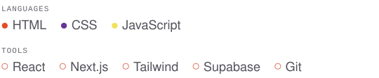

### Hi, I'm Tiago.

I build for the browser with React and JavaScript. My main work is the platform behind Academia Combate de Gaia, a combat sports academy in Gaia: public site, member portal, class bookings and payments for around 400 members. The code is private, but [the case study](https://bytiago.com/work/acg/) isn't.

Alongside it, a few personal projects: a fictional skate shop and an illustrated book about my pug.

Open to frontend roles in the Porto area.

[Portfolio](https://bytiago.com) · [Email](mailto:tiago@bytiago.com)
